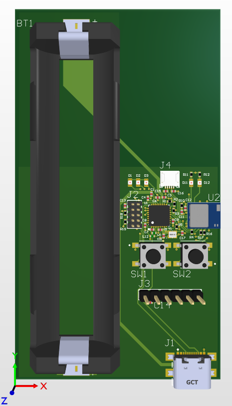

# Układ kontroli dostępu — praca inżynierska

Projekt sprzętowy (PCB) urządzenia do kontroli dostępu, realizowany w ramach pracy
inżynierskiej na kierunku **Inżynieria Internetu Rzeczy** (Politechnika Warszawska,
Wydział Elektroniki i Technik Informacyjnych).

Urządzenie autoryzuje dostęp na podstawie **odcisku palca** oraz komunikacji
**NFC** i **BLE**, zbudowane wokół modułu radiowego **BL54L15u (Nordic nRF54L15)**.



---

## Funkcje

- Odczyt linii papilarnych jako element autoryzacji dostępu
- Komunikacja bezprzewodowa **BLE** (Bluetooth Low Energy)
- Komunikacja **NFC**
- Logika kontroli dostępu na module nRF54L15
- Własny projekt PCB — od schematu po layout

## Architektura sprzętowa

Schemat blokowy urządzenia znajduje się w pliku `Schemat_blokowy.SchDoc`.

Główne bloki:
- **MCU / radio** — moduł BL54L15u (Nordic nRF54L15: BLE + NFC) — `MCU.SchDoc`
- **Czytnik linii papilarnych** — [model / interfejs, np. UART/SPI — uzupełnij]
- **Zasilanie** — `Zasilanie.SchDoc` — [np. zasilanie z USB / baterii, regulacja napięcia — uzupełnij]

## Kluczowe układy

| Element | Opis |
| --- | --- |
| **BL54L15u** | Moduł radiowy oparty na Nordic **nRF54L15** (BLE + NFC), z anteną typu chip |
| **Czytnik linii papilarnych** | [model — uzupełnij] |
| **Zasilanie** | [opis — uzupełnij] |

## Zawartość repozytorium

| Plik | Opis |
| --- | --- |
| `KD_Praca_Inzynierska.PrjPcb` | Główny projekt PCB w Altium Designer |
| `Schemat_blokowy.SchDoc` | Schemat blokowy urządzenia |
| `MCU.SchDoc` | Schemat sekcji MCU / modułu radiowego |
| `Zasilanie.SchDoc` | Schemat sekcji zasilania |
| `PCB1.PcbDoc` | Layout PCB |
| `WlasneElementy.SchLib` | Własne (samodzielnie utworzone) symbole komponentów |
| `453-00223_BL54L15u_Chip ANT_SCH_Symbol_Altium.SchLib` | Symbol modułu BL54L15u |
| `basic_lib_v10.SchLib` | Biblioteka komponentów podstawowych |

## Jak otworzyć

Projekt wymaga **Altium Designer**:

1. Sklonuj repozytorium:
   ```bash
   git clone https://github.com/Krzymbolix/Praca-In-ynierska.git
   ```
2. Otwórz plik `KD_Praca_Inzynierska.PrjPcb` w Altium Designer.
3. Schematy otworzysz przez panel *Projects*; layout — w `PCB1.PcbDoc`.

## Stack / narzędzia

`Altium Designer` · `nRF54L15 (BL54L15u)` · `BLE` · `NFC` · `projektowanie PCB` ·
`firmware: nRF Connect SDK`

## Status

[np. „Projekt PCB ukończony, firmware w toku" — uzupełnij aktualny stan.]
Firmware: [link do repo z firmware, jeśli jest osobne — albo „w tym samym repo / w toku".]

## Autor

**Krzysztof Dobosz** — [github.com/Krzymbolix](https://github.com/Krzymbolix)
Praca inżynierska, Politechnika Warszawska (WEiTI), Inżynieria Internetu Rzeczy.
